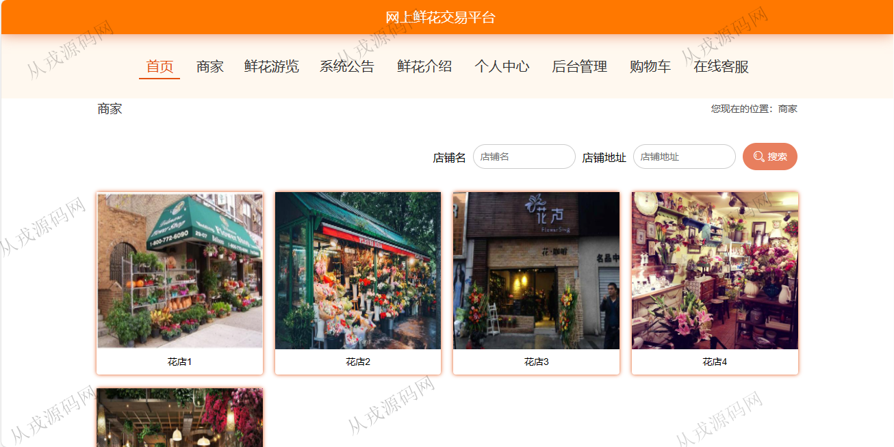
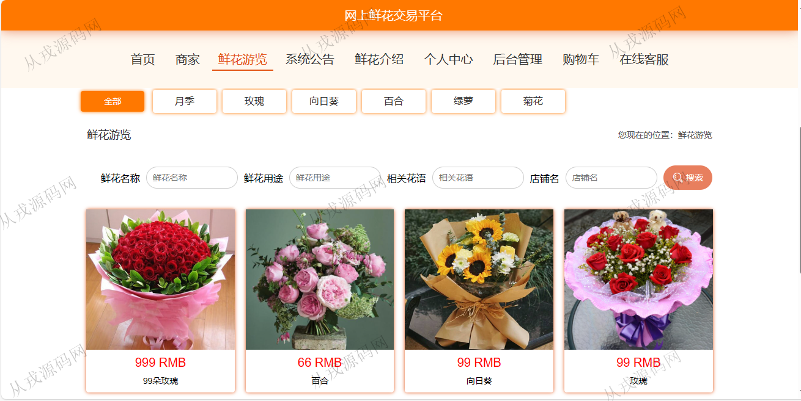

<h1 align="center">177.网上鲜花交易管理系统</h1>

 获取sql文件 QQ: 386869957 QQ群: 377586148 

 [更多源码项目: 从戎源码网](https://armycodes.com/) 

## 简介

> 本代码来源于网络,仅供学习参考使用!
>
> 提供1.远程部署/2.修改代码/3.设计文档指导/4.框架代码讲解等服务

> http://localhost:8080/bishe/front/index.html
> 
> 用户：user 123456
> 
> http://localhost:8080/bishe/admin/dist/index.html#/login
> 
> 管理员：admin 123456
> 

## 项目介绍
基于springboot+vue的网上鲜花交易管理系统：前端 vue、elementui，后端 maven、springmvc、spring、mybatis；角色分为管理员，用户；集成商家，鲜花浏览，购物车等功能于一体的系统。

## 功能介绍

### 用户

- 基本功能：登录，注册，退出
- 网站首页：主导航栏，轮播图，鲜花游览推荐，商家展示
- 商家：商家列表展示，按店铺名和店铺地址模糊搜索，商家详情，评论
- 鲜花：鲜花列表展示，按名称、用途、花语、店铺名模糊搜索，鲜花详情，购物车，在线结算
- 其他功能：系统公告，在线客服，鲜花结束
- 个人中心：个人信息查看与修改，我的订单查询，我的修改维护，我的收藏列表

### 管理员

- 用户管理：用户信息的增删改查，用户也可以在前台自行注册
- 商家管理：商家信息的增删改查，查看商家评论，评论回复，评论删除
- 鲜花分类管理：分类信息的增删改查
- 鲜花管理：鲜花信息的增删改查，图片上传，查看评论，评论回复，评论删除
- 系统管理：系统公告管理，在线客服，轮播图管理
- 订单管理：用户下单后，管理员查看用户订单，发货操作

## 环境

- <b>IntelliJ IDEA 2021.3</b>

- <b>Mysql 5.7.26</b>

- <b>Tomcat 7.0.73</b>

- <b>Node 14.14.0</b>

- <b>JDK 1.8</b>

## 运行截图

